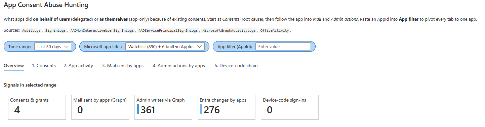
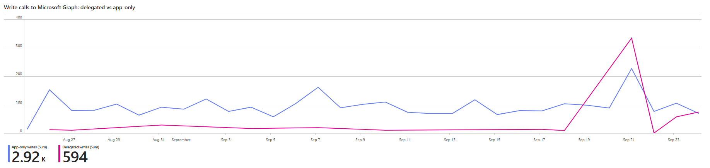
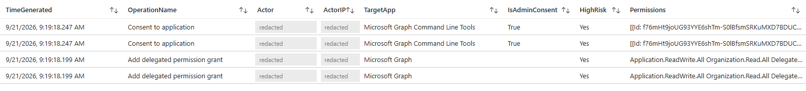

# App Consent Abuse Hunting

A Microsoft Sentinel workbook for finding out what OAuth apps in your Entra ID tenant actually did with the permissions they were given.

Most consent-abuse hunting stops at "who consented to what". That tells you how the attacker got in, but not what they did afterwards. This workbook starts at the consent and follows the app into the mail it sent, the directory changes it made, and, if you have `MicrosoftGraphActivityLogs`, the specific token behind each call.



| | |
|---|---|
| Platform | Microsoft Sentinel (also opens in Azure Monitor workbooks) |
| Author | Uğur Güdekli |
| Files | `App-Consent-Abuse-Hunting.workbook.json`, `Export-MsFirstPartySPs.ps1` (optional) |

## Contents

- [Why this exists](#why-this-exists)
- [What you need](#what-you-need)
- [Install](#install)
- [Microsoft app watchlist (optional)](#microsoft-app-watchlist-optional)
- [Using the workbook](#using-the-workbook)
- [Known limitations](#known-limitations)
- [MITRE ATT&CK](#mitre-attck)

## Why this exists

Consent abuse usually goes in three steps:

1. **Grant.** Someone consents to an app they shouldn't have. Either a user gets phished into it, or an attacker who already has a privileged role grants admin consent. These days it often comes through device-code or QR-code phishing, where the victim signs in on behalf of a device the attacker controls.
2. **Persist.** The app now has a refresh token or an application permission. Resetting the user's password doesn't remove it. With application permissions, the app doesn't need the user at all.
3. **Act.** The app reads and sends mail, pulls files, adds its own credentials or assigns roles. To Entra, all of it looks like normal authenticated API traffic.

Sign-in logs show you step 1 and part of step 2. Step 3 is where the damage happens, and you only see it in `MicrosoftGraphActivityLogs`. Most of this workbook is built on that table.

Two things to keep in mind when reading any panel:

- **Delegated or app-only.** In `MicrosoftGraphActivityLogs`, an empty `UserId` means the app called Graph as itself, using application permissions (`Roles`). A filled `UserId` means it acted on behalf of that user, using delegated scopes (`Scopes`). Cleaning up after each one is very different.
- **Granted or used.** An app that holds `Mail.ReadWrite` and never uses it is a hygiene issue. The same app sending POST requests with that permission is an incident.

## What you need

Send these to your Sentinel workspace from **Entra ID > Monitoring > Diagnostic settings**:

| Table | Used by | Needed? |
|---|---|---|
| `AuditLogs` | Consents, grants, changes made by apps | Yes |
| `MicrosoftGraphActivityLogs` | App activity, mail, admin writes, device-code chain | Yes, for tabs 2 to 5 |
| `SigninLogs` | App names, device-code sign-ins | Recommended |
| `AADNonInteractiveUserSignInLogs` | App names, device-code sign-ins, token chain | Recommended |
| `AADServicePrincipalSignInLogs` | App names | Recommended |
| `OfficeActivity` | Exchange sends that don't go through Graph (EWS, REST, SMTP OAuth) | Optional, needs the Microsoft 365 connector |
| `MsFirstPartySPs` watchlist | Hiding Microsoft's own apps on tabs 2 and 4 | Optional, see [below](#microsoft-app-watchlist-optional) |

Check `MicrosoftGraphActivityLogs` first. It's off by default, it's billed as analytics data, and it's noisy in most tenants. Without it, tabs 2 to 5 stay empty and you're left with a consent report.

If a table is missing, the panels that use it come up empty rather than erroring. The queries use `union isfuzzy=true` and `column_ifexists()` for that.

## Install

1. In Microsoft Sentinel, open **Workbooks** and click **Add workbook**.
2. Click **Edit**, then the **Advanced editor** (`</>`) button.
3. Paste the contents of `App-Consent-Abuse-Hunting.workbook.json`, click **Apply**, then **Save**.

If you deploy with ARM or Bicep, put the JSON in a `Microsoft.Insights/workbooks` resource with `serializedData` set to the file contents as a string and `category` set to `sentinel`.

That's enough to start. The watchlist in the next section is only there to cut noise.

## Microsoft app watchlist (optional)

Microsoft's own service principals (Office 365 Portal, Teams Services, Azure MFA, Identity Protection and a few hundred more) show up a lot on the App activity and Admin actions tabs. Service principal object IDs are different in every tenant, so there's no fixed list I can ship. `Export-MsFirstPartySPs.ps1` builds one for your tenant and uploads it as a Sentinel watchlist called `MsFirstPartySPs`.

You don't have to do this. Without the watchlist, the workbook hides nothing and shows every app.

### Before you run it

You need:

- Windows PowerShell 5.1 or PowerShell 7.
- One of these sign-in tools. The script uses the first one it finds:
  - `Install-Module Az.Accounts -Scope CurrentUser` (recommended)
  - `winget install Microsoft.AzureCLI`
  - `Install-Module Microsoft.Graph.Authentication -Scope CurrentUser` (can write the CSV but can't upload it)
- An account in the tenant that can read service principals. Normal members can, unless you've restricted user access to the directory. In that case use Directory Readers.
- Microsoft Sentinel Contributor on the workspace, if you want the script to upload the watchlist for you.

And two values:

- **Tenant ID.** The GUID on the Entra ID overview page, or a domain like `contoso.onmicrosoft.com`.
- **Workspace resource ID.** On the Log Analytics workspace, go to **Overview > JSON View** and copy **Resource ID**. Or:

  ```powershell
  (Get-AzOperationalInsightsWorkspace -ResourceGroupName <rg> -Name <ws>).ResourceId
  # or
  az monitor log-analytics workspace show -g <rg> -n <ws> --query id -o tsv
  ```

  It looks like `/subscriptions/<sub>/resourceGroups/<rg>/providers/Microsoft.OperationalInsights/workspaces/<ws>`.

### Run it

```powershell
.\Export-MsFirstPartySPs.ps1 -TenantId <your-tenant-id-or-domain> -WorkspaceResourceId "<Log Analytics workspace resource ID>"
```

What it does:

1. Signs in to the tenant you passed in `-TenantId`, and only that tenant. It turns off Windows single sign-on (WAM) for its own process, ignores any Az or Azure CLI sessions already on the machine, and checks the tenant ID inside every token it gets. If a token is for a different tenant, it stops before reading or writing anything.
2. Reads every service principal from Microsoft Graph and keeps the ones whose `appOwnerOrganizationId` is a Microsoft tenant.
3. Writes them to `MsFirstPartySPs.csv` in the current folder.
4. Deletes the existing `MsFirstPartySPs` watchlist, if there is one, and uploads the new list.
5. Signs out and cleans up its temporary session.

Leave out `-WorkspaceResourceId` if you only want the CSV.

Other parameters:

| Parameter | What it's for |
|---|---|
| `-UseDeviceCode` | Sign in with a code instead of a browser window. Handy when the browser keeps picking the wrong account. Conditional Access may block it. |
| `-MicrosoftOwnerTenants` | Which owner tenants count as Microsoft. This replaces the default list, so include `f8cdef31-a31e-4b4a-93e4-5f571e91255a` and `72f988bf-86f1-41af-91ab-2d7cd011db47` along with anything you add. |
| `-Alias` | Watchlist name. Leave it as `MsFirstPartySPs`, since that's what the workbook looks for. |
| `-OutputPath` | CSV file name, relative to the current folder. Defaults to `.\MsFirstPartySPs.csv`. |

The CSV lists your tenant's service principal IDs, so don't commit it anywhere public. This repo's `.gitignore` already ignores `*.csv`.

### Uploading the CSV yourself

If you ran the script without `-WorkspaceResourceId`, or the upload failed, go to **Microsoft Sentinel > Configuration > Watchlist > New** and fill in:

| Field | Value |
|---|---|
| Name and alias | `MsFirstPartySPs` (has to match exactly) |
| Source type | Local file |
| File type | CSV with a header |
| Lines before the header row | `0` |
| File | `MsFirstPartySPs.csv` |
| Search key | `ServicePrincipalId` |

The CSV has four columns. The workbook uses `ServicePrincipalId` (for `AuditLogs` rows that have no `appId`) and `AppId` (for everything else). `DisplayName` and `AppOwnerOrganizationId` are there so you can read the list.

### Check it worked

Give it a few minutes, then run this in **Logs**:

```kql
_GetWatchlist('MsFirstPartySPs') | count
```

The number should match what the script printed. The **Microsoft app filter** dropdown in the workbook also shows the count, for example `Watchlist (890) + 6 built-in AppIds`. If it says the watchlist wasn't found or is empty, the workbook is showing every app.

### Keeping it current

- Microsoft adds new apps to tenants over time. Run the script again every so often, or new ones will show up in the workbook.
- The script deletes the old watchlist before it uploads the new one. If the upload fails in between, you'll have no watchlist and the workbook shows everything until you run it again or upload the CSV by hand.
- Have a look through the CSV before you upload it. The next section explains which apps you might want to take out.

## Using the workbook

Start at **Overview**, pick a time range, and work left to right through the tabs. To focus on a single app, paste its AppId into **App filter**.

### Overview

Five counts for the selected range: consents and grants, mail sent by apps through Graph, admin writes through Graph, Entra changes made by apps, and successful device-code sign-ins. Below them is a chart of Graph write calls, split into delegated and app-only.



The counts are a starting point, not alerts. On the chart, look for changes in shape rather than big numbers. App-only writes usually have a steady background level, like the blue line above. A sudden jump in delegated writes from an app nobody recognises, especially after a phishing wave, is what device-code and QR-code phishing looks like. A jump in app-only writes means something is using application permissions like `Mail.Send` or `RoleManagement.ReadWrite.Directory`, or someone has a stolen client secret.

In the example above, the delegated line spikes on 21 September. The Consents tab shows why.

### 1. Consents

This tab shows three kinds of `AuditLogs` event: `Consent to application`, `Add delegated permission grant` and `Add app role assignment to service principal`.



The permission that was granted is stored in a different field depending on how it happened: `ConsentAction.Permissions` for interactive consent, `DelegatedPermissionGrant.Scope` for a direct grant, `AppRole.Value` for an app role assignment. The query flattens `modifiedProperties` and checks all three, because a query that only checks one will miss grants.

Each row shows who did it and from which IP, the target app, whether it was admin consent, and a `HighRisk` flag if the permissions include anything from the high-risk list (mail, files, directory writes, role management, Conditional Access and so on). High-risk rows come first.

In the screenshot, an admin consented to Microsoft Graph Command Line Tools with `Application.ReadWrite.All` a few minutes before the delegated write spike. That's the kind of link you're looking for.

Work through it in this order: admin consent to high-risk permissions, then user consent to high-risk permissions, then anything from an IP you don't recognise.

### 2. App activity

One row per app and access type, built from `MicrosoftGraphActivityLogs`. You get call count, write count, failures, distinct users, distinct source IPs, and `PermissionsUsed`, which is the `Scopes` or `Roles` the app actually sent with its calls.

`PermissionsUsed` is the important column. Entra tells you what an app is allowed to do; this column tells you what it did. An app that holds `Mail.ReadWrite` and never uses it needs cleaning up. An app using it on POST requests needs investigating.

Keep an eye on `FailedCalls`. Lots of 4xx errors across a wide range of URIs usually means someone is testing what a stolen token can reach.

### 3. Mail sent by apps

There are two panels here because neither source catches everything.

**Graph sends** looks for POST requests to `sendMail`, `send`, `reply`, `replyAll` and `forward`, and pulls the target mailbox out of the URI. App-only mail sends are rare outside known service accounts, so take them seriously.

**Exchange sends** looks at `Send`, `SendAs` and `SendOnBehalf` in `OfficeActivity`. This catches EWS, Outlook REST and SMTP OAuth, which never touch Graph. Five normal Microsoft clients (OWA, Microsoft Office, Outlook Mobile, One Outlook, Teams) are filtered out. Results are grouped by app with a count of mailboxes, so an app sending from lots of mailboxes (a worm) ends up at the top.

That filter is a trade-off. Device-code phishing usually borrows a Microsoft client ID, so the attack you're looking for may be one of the rows this panel hides. Check tab 5 as well; don't rely on this panel alone.

### 4. Admin actions by apps

**Entra audit** shows `AuditLogs` entries where `InitiatedBy.app` is set, meaning a service principal made the change without a user involved. `Sensitive` marks role assignments, new credentials, owner changes on apps and service principals, password resets, domain federation changes and Conditional Access edits.

Watch two of those closely. `Add service principal credentials` is how an attacker turns a delegated foothold into long-term app-only access: they add their own secret or certificate to an app you already trust. `Set federation settings on domain` is a federation backdoor, and it's rare enough that any hit is worth a look.

**Graph admin writes** finds the same kind of activity in Graph traffic. This includes delegated calls, which the audit log attributes to the user instead of the app. It matches `roleManagement`, `directoryRoles`, `oauth2PermissionGrants`, `appRoleAssignments`, `addPassword`, `addKey`, `federatedIdentityCredentials`, `identity/conditionalAccess`, `policies`, `domains`, `authentication/methods` and `owners` in the request URI.

Use both panels. The audit log tells you what changed, and Graph tells you which token did it.

### 5. Device-code chain

This tab connects a phishing sign-in to what the attacker did with it.

The first panel lists device-code sign-ins. The second follows each one through:

1. It combines `SigninLogs` and `AADNonInteractiveUserSignInLogs` and groups them by `SessionId`. If `SessionId` is empty, it uses `UniqueTokenIdentifier` instead.
2. It keeps sessions with a successful device-code sign-in (`AuthenticationProtocol` is `deviceCode`, or `OriginalTransferMethod` is `deviceCodeFlow`).
3. It collects every token issued in those sessions. This is how refresh tokens issued hours after the phish still get tied back to it.
4. It joins those tokens to `MicrosoftGraphActivityLogs` on `SignInActivityId` and summarises what each session did.

You get one row per session: when and from where the phish happened, which app was used, the IPs that called Graph afterwards, what they did, and a `MailSends` count.

If `MailSends` is above zero, look at it first. A device-code sign-in followed by that token sending mail is the self-spreading QR-code phish, and it's very hard to explain any other way.

When `SessionId` is empty and the query falls back to `UniqueTokenIdentifier`, it only sees the original device-code token. Refresh tokens from that session are missed. A short or empty result may just mean the data is incomplete, so don't read it as all clear.

## Known limitations

**App filter doesn't reach every panel.** The header says it applies to every tab, but the Overview counts, the Consents tab, the device-code list and the token chain ignore it. Treat those as tenant-wide, or add `| where AppId == AppFilter` to them.

**High-risk permission matching.** `has_any` splits on dots, so `Mail.Read` doesn't match `Mail.ReadWrite`. Both are listed for that reason. Add any new permission by its full name. New Graph permissions won't be flagged until someone adds them.

**The Exchange client filter can hide attacks.** See tab 3. It's there to cut noise, not because those clients are safe.

**App names only go back 30 days.** Names come from sign-in logs over the last 30 days, whatever time range you pick. An app that hasn't signed in for longer shows up with an AppId and no name.

**Cost.** `MicrosoftGraphActivityLogs` is big. On a large tenant, pick a short time range before you open the workbook. The token chain is the most expensive query, with a union and two joins.

**Tune before alerting.** Everything here is set up for interactive hunting. Get a baseline for your own tenant before you turn any of it into an analytics rule.

### How the Microsoft app filter works

The **Microsoft app filter** dropdown only affects App activity (tab 2) and the two Admin actions panels (tab 4). Overview, Consents, Mail and the Device-code chain are never filtered.

| Option | What it hides |
|---|---|
| Watchlist (default) | Everything in `MsFirstPartySPs`. If the watchlist is missing or empty, nothing is hidden. |
| Watchlist + 6 built-in AppIds | The watchlist, plus Office 365 Portal, Teams Services, Azure MFA, Identity Protection, Device Registration Service and Managed Service Identity. These AppIds are the same in every tenant. |
| Off | Nothing |

The dropdown labels show how many entries the watchlist has. A missing watchlist doesn't break any query; nothing gets hidden.

**This hides more than background noise.** The watchlist includes every app Microsoft owns, and the Graph panels filter by AppId. That includes Microsoft Graph Command Line Tools, Azure CLI, Azure PowerShell, Microsoft Office and Microsoft Authentication Broker, which are exactly the clients attackers use for device-code phishing. With the filter on, a phished admin token that assigns a role through Azure CLI won't show up in Graph admin writes. You can deal with this in two ways:

- Turn the filter **Off** when you're investigating a specific user or incident, and treat the Device-code chain tab, which is never filtered, as the source of truth.
- Or take those public client apps out of the CSV before uploading, so the watchlist only hides background services.

Also remember that the filter only hides things; it doesn't mean they're safe. If an attacker adds credentials to a Microsoft-owned service principal or abuses a managed identity, those panels won't show it while the filter is on.

### A Microsoft app still shows up

Its owner tenant probably isn't one of the two the script knows about.

1. Run the coverage check below and note the `AppId` on rows where `InWatchlist` is false.
2. Find out who owns it: `Get-MgServicePrincipal -Filter "appId eq '<AppId>'" -Property DisplayName, AppOwnerOrganizationId`.
3. If it really is Microsoft's, run the script again with that tenant added:

   ```powershell
   .\Export-MsFirstPartySPs.ps1 -TenantId <your-tenant-id-or-domain> -WorkspaceResourceId "<Log Analytics workspace resource ID>" `
       -MicrosoftOwnerTenants 'f8cdef31-a31e-4b4a-93e4-5f571e91255a','72f988bf-86f1-41af-91ab-2d7cd011db47','<new-owner-tenant-id>'
   ```

Coverage check. It lists every app that made changes in `AuditLogs` over the last 30 days and whether the watchlist covers it:

```kql
let Wl = _GetWatchlist('MsFirstPartySPs')
    | project WlSPId = tostring(column_ifexists("ServicePrincipalId", "")), WlAppId = tostring(column_ifexists("AppId", ""));
AuditLogs
| where TimeGenerated > ago(30d)
| where isnotempty(tostring(InitiatedBy.app.servicePrincipalId)) or isnotempty(tostring(InitiatedBy.app.appId))
| summarize Events = count(), Operations = make_set(OperationName, 10)
            by AppName = tostring(InitiatedBy.app.displayName),
               AppId = tostring(InitiatedBy.app.appId),
               ServicePrincipalId = tostring(InitiatedBy.app.servicePrincipalId)
| extend InWatchlist = ServicePrincipalId in ((Wl | where isnotempty(WlSPId) | project WlSPId))
                    or AppId in ((Wl | where isnotempty(WlAppId) | project WlAppId))
| order by InWatchlist asc, Events desc
```

## MITRE ATT&CK

| Technique | Tab |
|---|---|
| T1528 Steal Application Access Token | 1, 5 |
| T1550.001 Use Alternate Authentication Material: Application Access Token | 2, 5 |
| T1098.001 Account Manipulation: Additional Cloud Credentials | 4 |
| T1098.003 Account Manipulation: Additional Cloud Roles | 4 |
| T1114.002 Email Collection: Remote Email Collection | 3 |
| T1566 Phishing (device code / QR code) | 5 |
| T1484.002 Domain or Tenant Policy Modification: Trust Modification | 4 |

## Contributing

Issues and PRs are welcome, especially additions to the high-risk permission list, fixes to the Exchange client filter, and consent-abuse paths the workbook doesn't cover yet.

## Disclaimer

Provided as is, no warranty. These are hunting queries, not tested detections. Try them in your own tenant and tune the filters and thresholds before you act on the results or turn them into alerts.
